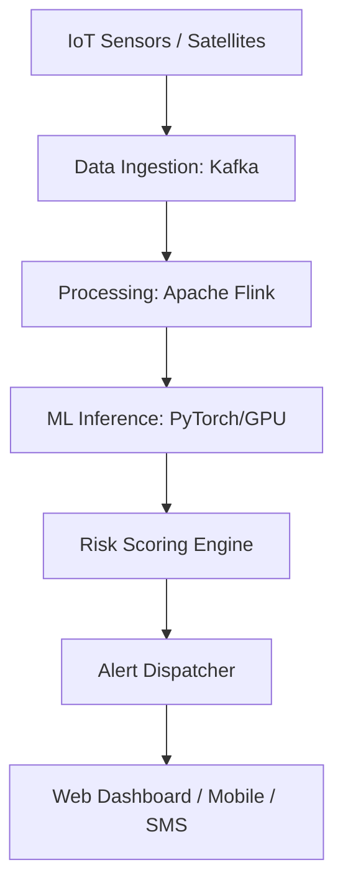

# Aegis Disaster AI: National Early Warning & Prediction Platform

A production-grade, FAANG-level Natural Disaster Prediction & Early Alert Platform designed for governments, NGOs, and large-scale enterprises.

## 🎯 Product Overview

Aegis leverages state-of-the-art Deep Learning and Geospatial ML to predict floods, earthquakes, cyclones, and landslides with high precision. It operates at a national scale, providing multi-channel alerts (SMS, Push, WhatsApp, Siren) to save lives and minimize economic impact.

### Key Features
- **Multi-Hazard Prediction**: LSTM and Temporal Transformer models for diverse disaster types.
- **Real-time Ingestion**: Kafka-based streaming for IoT sensors, river gauges, and seismic data.
- **Geospatial Heatmaps**: Live visualization of risk zones using satellite imagery and terrain features.
- **Government-Grade Security**: RBAC, OAuth2/JWT, and full audit logging for sensitive data.
- **Scalable Infrastructure**: Kubernetes-native deployment with GPU-accelerated inference.

## 🏗️ Architecture



## 📁 Project Structure

- `client/`: React SPA Frontend (Dashboard, Maps, Analytics).
- `server/`: Express API Backend (Risk scores, Alert management).
- `ml/`: AI/ML System (Models, Training, Inference).
- `infra/`: Infrastructure as Code (K8s, Terraform, Docker).
- `shared/`: Shared TypeScript interfaces for type-safe communication.

## 🚀 Getting Started

### Prerequisites
- Node.js 18+
- PNPM
- Python 3.9+ (for ML modules)
- Docker & Kubernetes (for deployment)

### Installation
```bash
pnpm install
pnpm dev
```

## 🔐 Security & Compliance
- Data encryption at rest and in transit.
- Compliance with international data regulations (GDPR, HIPAA where applicable).
- Disaster data integrity checks via cryptographic hashing.

## 📈 Commercial Model
- **Government SaaS**: National-level licensing for disaster management authorities.
- **Enterprise Analytics**: Risk assessment for insurance and infrastructure companies.
- **API Access**: Tiered pricing for third-party integrations.

---
*Build by Suriyaprakash M
.*
